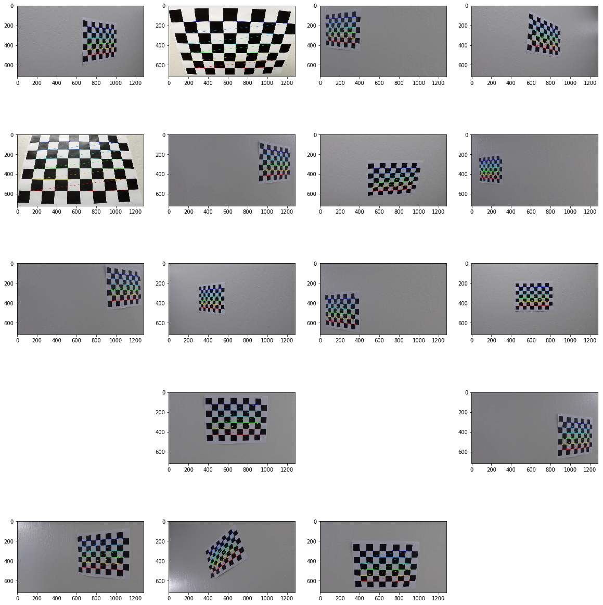
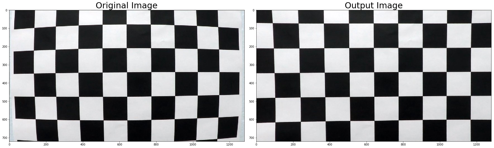
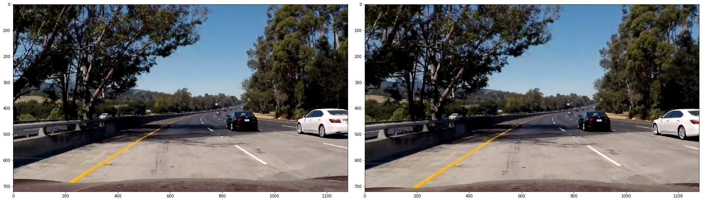
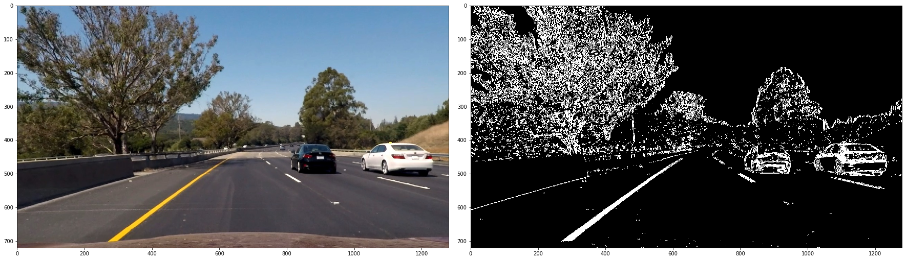
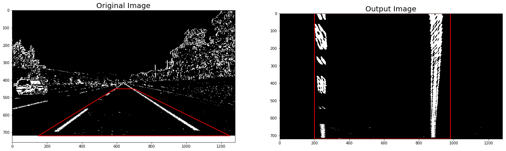
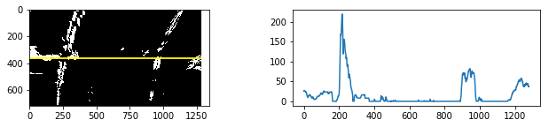
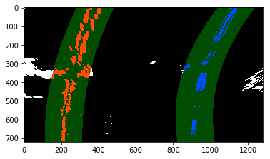
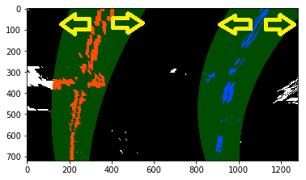
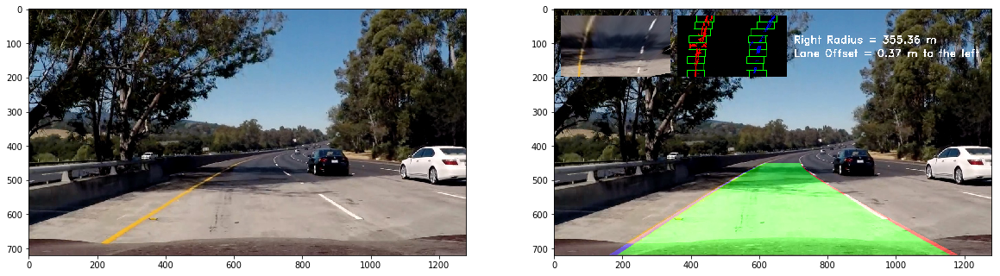

# Self-Driving Car Engineer Nanodegree

## Project : Advanced Lane Finding  

The goals / steps of this project are the following:
* Compute the camera calibration matrix and distortion coefficients given a set of chessboard images.
* Apply a distortion correction to raw images.
* Use color transforms, gradients, etc., to create a thresholded binary image.
* Apply a perspective transform to rectify binary image ("birds-eye view").
* Detect lane pixels and fit to find the lane boundary.
* Determine the curvature of the lane and vehicle position with respect to center.
* Warp the detected lane boundaries back onto the original image.
* Output visual display of the lane boundaries and numerical estimation of lane curvature and vehicle position.

### Camera Calibration

#### 1. Briefly state how you computed the camera matrix and distortion coefficients. Provide an example of a distortion corrected calibration image.

I start by preparing "object points", which will be the (x, y, z) coordinates of the chessboard corners in the world. Here I am assuming the chessboard is fixed on the (x, y) plane at z=0, such that the object points are the same for each calibration image.  Thus, `objp` is just a replicated array of coordinates, and `objpoints` will be appended with a copy of it every time I successfully detect all chessboard corners in a test image.  `imgpoints` will be appended with the (x, y) pixel position of each of the corners in the image plane with each successful chessboard detection.  
<div style="text-align:center"><br/>
<br/>
The detected chessboard corners<br/><br/>
</div>
From the previous image it can be observed that the number of corners in the x axis is 9, while in the y axis is 6.  
I then used the output `objpoints` and `imgpoints` to compute the camera calibration and distortion coefficients using the `cv2.calibrateCamera()` function.  I applied this distortion correction to the test image using the `cv2.undistort()` function and obtained this result: 
<div style="text-align:center"><br/>
<br/>
The undistorted chessboard image<br/><br/>
</div>

### Pipeline (single images)

#### 1. Provide an example of a distortion-corrected image.

To demonstrate this step, I will describe how I apply the distortion correction in the 4th code cell (In[4]:) of `P4.ipynb` to the test images like this one:

<div style="text-align:center"><br/>
<br/>
An original (left) and undistorted (right) image<br/><br/>
</div>

#### 2. Describe how (and identify where in your code) you used color transforms, gradients or other methods to create a thresholded binary image.  Provide an example of a binary image result.

I used a combination of X direction gradient and S color channel thresholds to generate a binary image using a function called `CombineBinary()` . Here's an example of my output for this step:

<div style="text-align:center"><br/>
<br/>
An undistorted (left) and combined binary (right) image<br/><br/>
</div>

#### 3. Describe how (and identify where in your code) you performed a perspective transform and provide an example of a transformed image.

I used the `cv2.warpPerspective()` for perspective transform.
This resulted in the following source and destination points:  
src  
([[150, 720],  
  [590, 450],  
  [700, 450],  
  [1250, 720]])   
 dst  
([[200 , 720],  
  [200  ,  0],  
  [980 ,   0],   
  [980 , 720]])  

I verified that my perspective transform was working as expected by drawing the `src` and `dst` points onto a test image and its warped counterpart to verify that the lines appear parallel in the warped image.

<div style="text-align:center"><br/>
<br/>
A combined binary (left) and warped (right) image<br/><br/>
</div>

#### 4. Describe how (and identify where in your code) you identified lane-line pixels and fit their positions with a polynomial?

To detect the pixels that correspond to the lane lines the histogram is used as as a basis. The peaks in an histogram of the binary image in birds view represent the position of the lanes, as shown in the following example:

<div style="text-align:center"><br/>
<br/>
Histogram of the number of pixels below the yellow line<br/><br/>
</div>

The find_lanes_sliding_windows() function implements a slinding windows approach in which the histogram is used in each window to detect the lane lines. The detection of the lane lines is based on a second order polynomial by using the np.polyfit() function. T

<div style="text-align:center"><br/>
<br/>
</div>

As previously mentioned, the find_lanes_sliding_windows() function implements the lane lines detection by using an sliding window approach. However, once we have the estimation of both lane lines for a given frame, it is possible to exploit the fact that the estimation is similar between consecutive frames in a video. This enables the implementation of a more effecient lane estimation approach, which focuses of a narrow area around the lane lines detected in previous frames to avoid performing the sliding window approach for every frame from scratch. The find_lanes_previous_fit() function implements the lane line detection using previous polynomial estimations. As example of this is shown in the following image:

<div style="text-align:center"><br/>
<br/>
</div>

Furthermore, in the aroundabout search, it is in the form of an area that spreads toward the front
The reason is that the front lane moves a lot while the front lane has a small amount of movement.
<div style="text-align:center"><br/>
<br/>
improved_around_search_area image<br/><br/>
</div>

#### 5. Describe how (and identify where in your code) you calculated the radius of curvature of the lane and the position of the vehicle with respect to center.

The left and right curvature are calculated using `ym_per_pix` = 30/720 [m/pixel].
I approximated from the polynomials of the lanes using the following formula.  

<div style="text-align:center"><br/>
<br/>
</div>

Also, I multiply the offset pixel between the center of both lane lines and the center of the picture by `xm_per_pix` = 3.7/700 [m/pixel] to calculate the vehicle position. A minus value means that the vehicle is on left from the center of the road, and a plus value means that the vehicle is on right.

```ptyhon
    lane_ctr = (left_x_eval + right_x_eval)/2
    vehicle_ctr = (binary_warped.shape[1])/2 
    offset = (lane_ctr - vehicle_ctr) * xm_per_pix
```

#### 6. Provide an example image of your result plotted back down onto the road such that the lane area is identified clearly.

Finally, fills the space between two fitted lines, and un-warps (warps back) the image using `M_inv`, a matrix just source points `src` and destination points `dst` are opposite from warping matrix `M`.

<div style="text-align:center"><br/>
<br/>
Original image (left) and un-warped (right) image<br/><br/>
</div>
---

### Pipeline (video)

#### 1. Provide a link to your final video output.  Your pipeline should perform reasonably well on the entire project video (wobbly lines are ok but no catastrophic failures that would cause the car to drive off the road!).

Here's a link to my video result [(./output_videos/project_output.mp4)](./output_videos/project_output.mp4)

I devised the following three points to apply to the video.
1. Perform averaging between N = 35 frames to smooth.
```python
    N = 35 # flame number for calculate average
    if len(List_left_fit) < N or len(List_right_fit) < N :
        List_left_fit.append(left_fit)
        List_right_fit.append(right_fit)   
    else:
        List_left_fit.append(left_fit)
        List_right_fit.append(right_fit)
        List_left_fit.pop(0)        
        List_right_fit.pop(0)           
    avg_left_fit = np.mean((List_left_fit),axis=0) *0.5 + left_fit*0.5
    avg_right_fit = np.mean((List_right_fit),axis=0) *0.5 + right_fit*0.5    
```  
If the around search area is incorrect, the number of detected pixels is less than 1500 and it is judged as an NG judgment, so that it switches to the slide window.
```python
 minpix = 1500 
    if len(leftx) < minpix or len(rightx) < minpix :
        left_fit = avg_left_fit
        right_fit = avg_right_fit
        Easy_search = False
```  

2. Add a system to switch the line search process to around search to improve processing speed and prevent erroneous line detection
```python
#Switching for searchig code
if Easy_search is False: #Use Sliding_window_searching
    left_fit, right_fit, leftx, lefty, rightx, righty, out_img = find_sliding_window(warped_binary)
  ･･･
else: #Use previous polynomials area _searching
    left_fit = List_left_fit[-1] 
    right_fit = List_right_fit[-1] 
    left_fit, right_fit, leftx, lefty, rightx, righty, colored_binary_img = search_around_poly(warped_binary,left_fit, right_fit)     
```  

3. Set the following criteria to detect the line correctly  
・ Change of lane width is within ± 20%  
・ Change amount of vehicle center position is 0.3m or less  
・ The amount of change in curvature of the curve is less than twice each of the left and right lines  
```python  
#Use the previous line if the line width change rate is 0.8 times or more    
if Lane_width < 0.8*pvs_avg_Lane_width or Lane_width is 0:
       left_fit = avg_left_fit 
       right_fit = avg_right_fit
       
#Use the previous line if the offset change rate is 0.3 times or more 
if abs(offset - prv_offset) > 0.3: 
            left_fit = List_left_fit[-1]
            right_fit = List_right_fit[-1]
            
 #Use the previous line if the amount of change in curvature of the curve is
 less than twice each of the left and right lines
 differential_L = abs(L_curverad - prv_L_curverad)/abs(prv_L_curverad)
 differential_R = abs(R_curverad - prv_R_curverad)/abs(prv_R_curverad)        
 #Eliminate irregular curvatures by changing the curvature of the left and right curves
 if abs(differential_L+differential_R)/(2*differential_R) >2.5 and differential_L > 1.5: 
     left_fit = List_left_fit[-1]
 if abs(differential_R+differential_L)/(2*differential_L) >2.5 and differential_R > 1.5:
     right_fit = List_right_fit[-1]
```

### Discussion

#### 1. Briefly discuss any problems / issues you faced in your implementation of this project.  Where will your pipeline likely fail?  What could you do to make it more robust?

##### 1.Lanes hidden by obstacles    　
This program assumes that there is no vehicle in front of the vehicle. Having a vehicle (or a bus, Truck, bike) can obscure part of the lane and cause problems with detection.
One solution is to detect the vehicle (using computer vision, machine learning etc) and implement the function of subtracting the detected car position from the area for finding lane lines.

##### 2.Loss of vanishing point   
Other problem will cause when the curvature of the lane lines is too sharp. The interested area (masked area) for seeking lane lines in this project is fixed, not dynamic.

To avoid this, either change the region of interest (mask region) according to the situation around the vehicle, or a human driver turns his head and looks at the direction of rotation, You can install the camera. (Everyone is just looking forward with a perfectly fixed head and can not turn sharp curves.)  

By predicting the vanishing point with deep learning and combining the lane search program of this program, it is considered that measures against 1.2 above can be taken.  

